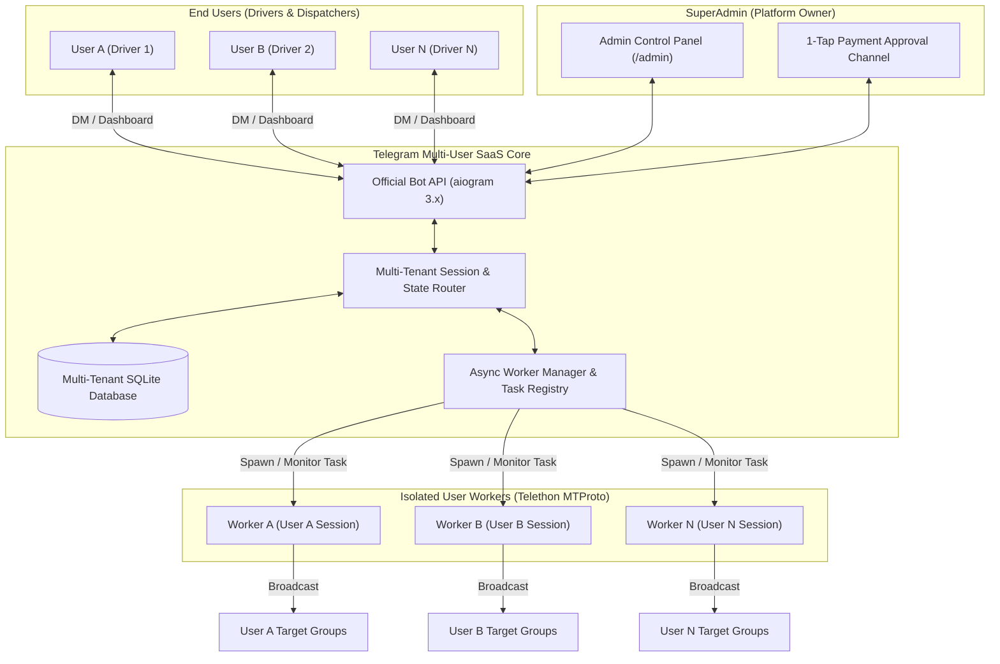

# Technical Specification (TZ): Dual-Engine Telegram Broadcast System (v2.0 Multi-User SaaS)

## 1. Executive Summary & Core Concept
The **v2.0** architecture upgrades the system from a single-operator bot into a **Multi-Tenant Software-as-a-Service (SaaS) Platform** designed for taxi drivers, logistics operators, and commercial advertisers across Uzbekistan.

Each registered user receives an **isolated private dashboard**, connects their own Telegram worker account directly within the Telegram chat interface (without touching the server terminal), sets their private source channel, and manages their own target broadcast groups independently.

---

## 2. Multi-Tenant Architectural Overview



---

## 3. Database Schema Upgrades (Multi-Tenant)

The single global settings structure is replaced with user-scoped relational tables:

### 1. `users` Table
Tracks user identities, trial status, and subscription lifecycles.
* `user_id` (INTEGER PRIMARY KEY) — Telegram User ID of the client.
* `full_name` (TEXT) — Client's Telegram name.
* `username` (TEXT) — Client's `@username`.
* `phone_number` (TEXT) — Client's verified phone number.
* `subscription_expiry` (TIMESTAMP) — Date & time when current access ends.
* `is_lifetime_discount` (BOOLEAN DEFAULT 1) — Flag for early startup clients (locks in 25k/mo rate).
* `is_banned` (BOOLEAN DEFAULT 0) — Administrative ban flag.
* `created_at` (TIMESTAMP DEFAULT CURRENT_TIMESTAMP)

### 2. `user_settings` Table
Individual operational configuration for each user.
* `user_id` (INTEGER PRIMARY KEY) — Foreign key to `users`.
* `is_running` (BOOLEAN DEFAULT 0) — Active broadcast toggle.
* `source_chat_id` (INTEGER) — ID of the user's private source group/channel.
* `source_chat_title` (TEXT) — Name of the user's source chat.
* `drop_author` (BOOLEAN DEFAULT 0) — 0: Native forward, 1: Drop author (clean copy).
* `cycle_min` (INTEGER DEFAULT 60) — Minimum inter-round cooldown in seconds.
* `cycle_max` (INTEGER DEFAULT 90) — Maximum inter-round cooldown in seconds.
* `jitter_min` (REAL DEFAULT 1.5) — Minimum inter-group delay in seconds.
* `jitter_max` (REAL DEFAULT 2.0) — Maximum inter-group delay in seconds.

### 3. `user_target_groups` Table
Isolated destination groups per user.
* `id` (INTEGER PRIMARY KEY AUTOINCREMENT)
* `user_id` (INTEGER) — Foreign key to `users`.
* `chat_id` (INTEGER) — Target Telegram group ID.
* `title` (TEXT) — Group title.
* `username` (TEXT) — Public username if available.
* `is_active` (BOOLEAN DEFAULT 1) — Group inclusion toggle.
* `status` (TEXT DEFAULT 'Healthy') — Last dispatch outcome.
* `created_at` (TIMESTAMP DEFAULT CURRENT_TIMESTAMP)

### 4. `payment_requests` Table
Tracks payment receipts submitted for manual/semi-automated approval.
* `id` (INTEGER PRIMARY KEY AUTOINCREMENT)
* `user_id` (INTEGER)
* `plan_months` (INTEGER) — 1, 3, 6, or 12.
* `amount_uzs` (INTEGER) — Amount in UZS.
* `receipt_file_id` (TEXT) — Telegram photo file ID of the cheque.
* `status` (TEXT DEFAULT 'PENDING') — 'PENDING', 'APPROVED', 'REJECTED'.
* `created_at` (TIMESTAMP DEFAULT CURRENT_TIMESTAMP)

---

## 4. Codebase & System Logic Upgrades

### A. In-Bot Interactive Telegram Login (No Terminal Needed)
Replaces `src/auth.py` CLI with a seamless Finite State Machine (FSM) inside Telegram chat:
1. **Phone Request:** User taps `📱 Akkauntni ulash`. Bot displays a *"📱 Telefon raqamni yuborish"* keyboard button.
2. **Code Dispatch:** Backend initializes a new Telethon instance for that user, requests MTProto login code, and caches `phone_code_hash`.
3. **Code Input:** Prompts user to send the 5-digit code formatted with spaces (e.g. `1 2 3 4 5`).
4. **2FA Password (If active):** Prompts for cloud password if account has two-factor authentication.
5. **Session Storage:** Generates and stores `sessions/user_{user_id}.session`.

### B. Dynamic Worker Manager & Task Isolation
* The `WorkerManager` manages isolated background tasks for every user with an active subscription and `is_running=True`.
* **Complete Fault Isolation:** If User A's account hits a `FloodWait` or gets muted in a group, **User B's worker is 100% unaffected**.

### C. Subscription & Trial Enforcement Engine
* **Automatic 3-Day Trial:** On first registration, user automatically receives 72 hours of full VIP access.
* **Auto-Expiration Middleware:** When `subscription_expiry < CURRENT_TIMESTAMP`:
  * Broadcasting task is automatically stopped.
  * User is greeted with a polite renewal reminder and payment packages.
* **Warning Notifications:** Automatic DMs sent at **24 hours** and **2 hours** before expiration.

---

## 5. Pricing Plans & Payment Processing

### A. Pricing Structure

| Package | Standard Price | 🔥 Startup Launch Price | Multi-Month Discount | Monthly Rate |
| :--- | :---: | :---: | :---: | :---: |
| **1 Month** | ~~40,000 UZS~~ | **`25,000 UZS`** | 38% Startup Discount | 25,000 UZS/mo |
| **3 Months** | ~~108,000 UZS~~ | **`65,000 UZS`** | 10% Package Discount | ~21,600 UZS/mo |
| **6 Months** | ~~192,000 UZS~~ | **`120,000 UZS`** | 20% Package Discount | 20,000 UZS/mo |
| **12 Months** | ~~360,000 UZS~~ | **`225,000 UZS`** | 25% Discount + **1 Month Free** *(13 mo)* | ~17,300 UZS/mo |

* **The Startup Grandfather Guarantee:** Users subscribing during the startup period keep the 25,000 UZS base renewal price permanently.

---

### B. 1-Tap Receipt Approval Flow (No Legal Entity Required)

```
[User selects Plan] ➡️ [Bot sends Card Number & Code] ➡️ [User uploads Cheque Photo]
                                                                    │
                                                                    ▼
                                      [Bot forwards to SuperAdmin Channel]
                                      ┌────────────────────────────────────┐
                                      │ 🧾 Yangi to'lov: Shavkat Aliyev   │
                                      │ 👤 ID: 123456789 (@shavkat_driver) │
                                      │ 📦 Tarif: 3 Oy (65,000 so'm)       │
                                      │ 🖼 [Chek Rasmi]                    │
                                      │                                    │
                                      │ [ ✅ Tasdiqlash ] [ ❌ Rad etish ]  │
                                      └──────────────────┬─────────────────┘
                                                         │ (Admin taps 1 button)
                                                         ▼
                       [Bot adds 90 days to User & sends Success Notification!]
```

---

## 6. End-to-End User Workflow Comparison

| Stage | v1.0 (Single-Tenant) | v2.0 (Multi-User SaaS) |
| :--- | :--- | :--- |
| **Target User** | Platform Owner only | Unlimited Drivers & Commercial Clients |
| **Authentication** | Terminal input (`auth.py` on VPS) | 100% In-Chat via Telegram buttons & prompts |
| **Database** | Global settings | User-scoped multi-tenant database |
| **Access Control** | Single `ADMIN_ID` whitelist | Open to all, gated by 3-day trial & subscriptions |
| **Worker Tasks** | 1 Global background loop | Independent concurrent tasks per active client |
| **Billing** | None (Personal use) | 4 Pricing packages + 1-Tap receipt approval channel |
| **Management** | Server config editing | Comprehensive `/admin` dashboard for SuperAdmin |
